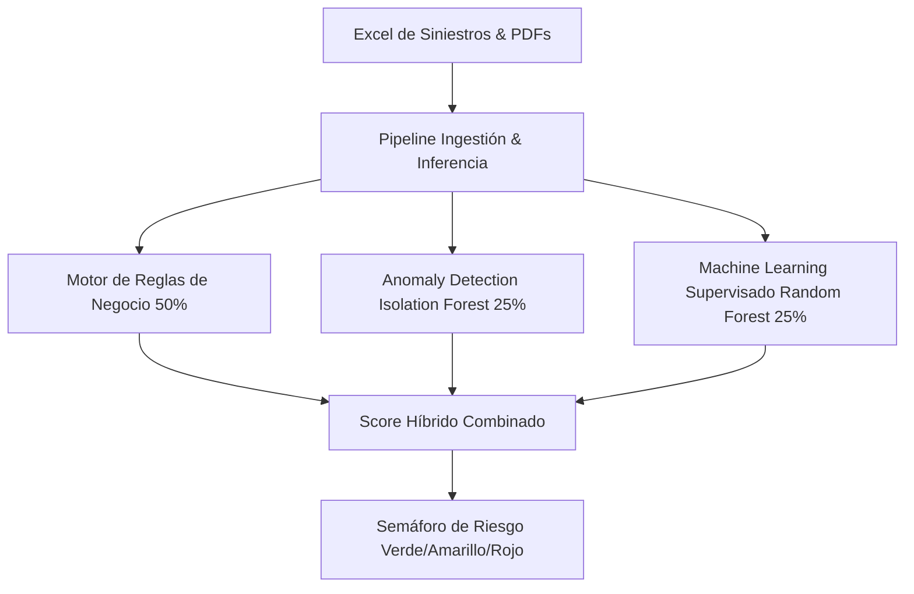
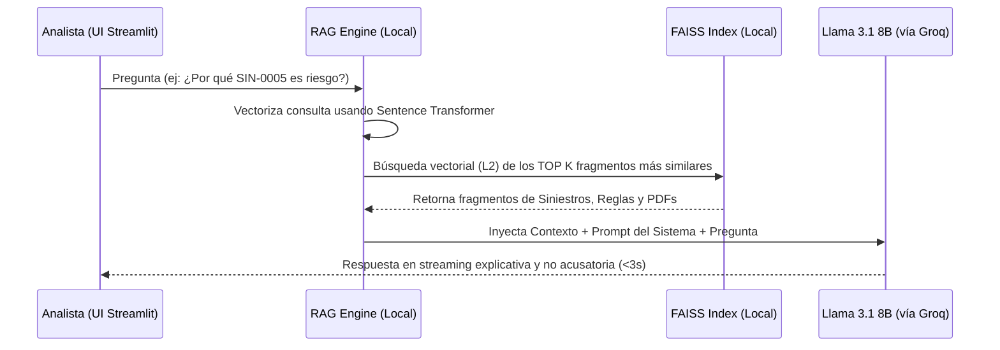

# 📐 ARQUITECTURA DE SOFTWARE — FRAUDIA

Este documento describe formalmente la arquitectura del sistema **FRAUDIA**, un detector de posibles fraudes en siniestros de seguros diseñado para la **Aseguradora del Sur**. El sistema implementa un enfoque de inteligencia artificial híbrido altamente escalable.

---

## 1. Diseño y Estructura Híbrida

FRAUDIA combina tres paradigmas de computación e inteligencia artificial para garantizar alta precisión y explicabilidad:

1. **Motor de Reglas de Negocio (50% del Score):** Implementa lógica de control basada en la rúbrica de 14 señales del PDF del reto y 7 reglas de negocio críticas (RF-01 a RF-07) que fuerzan semáforos rojos y amarillos de forma determinista para resguardar la consistencia regulatoria.
2. **Detección de Anomalías (25% del Score):** Utiliza un algoritmo de *Isolation Forest* no supervisado para modelar el comportamiento normal de los siniestros basándose en variables numéricas y similitudes textuales de NLP, descubriendo atipicidades complejas que escapan a las reglas fijas.
3. **Machine Learning Supervisado (25% del Score):** Emplea un modelo clasificador *Random Forest* entrenado sobre una etiqueta independiente que correlaciona discrepancias documentales y atipicidades estadísticas para inferir la probabilidad de fraude en casos nuevos.

---

## 2. Flujo de Datos del RAG (Retrieval-Augmented Generation)

El sistema agéntico conversacional utiliza una arquitectura RAG para responder preguntas libres en lenguaje natural basándose en los 500 siniestros, proveedores y documentos PDF asociados de la Aseguradora del Sur.

---

## 3. Escalabilidad e Integración Productiva

* **Frontend:** Desarrollado como un monolito ágil en **Streamlit** para visualización corporativa interactiva y demostraciones del hackathon.
* **REST API:** Construido con **FastAPI** para desacoplar el motor de cálculo y validación, permitiendo su integración con sistemas Core de seguros vía microservicios corporativos.
* **Privacidad y Portabilidad:** El pipeline de embeddings de sentence-transformers y el almacenamiento vectorial con FAISS se ejecutan localmente en disco, eliminando la dependencia de servidores externos para resguardar el secreto profesional y la LOPD.
